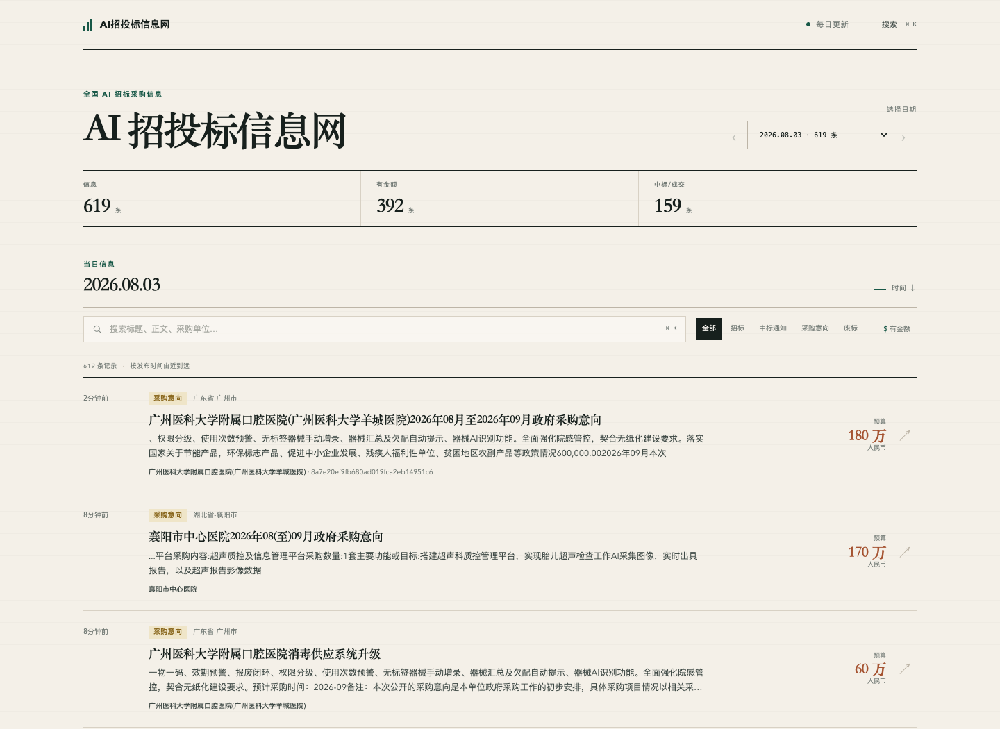
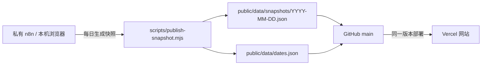

# AI 招投标信息流

一个按日期浏览的 AI 招投标公开信息流。

这个仓库就是网站本身的公开源：网站代码、公开数据快照和日期索引都同步在这里。每日采集成功后，新的数据快照进入 GitHub，随后 Vercel 部署同一个仓库版本。



## 现在可以做什么

- 选择某一天，查看当天完整信息流
- 按发布时间从近到远阅读
- 搜索标题、正文摘要和采购单位
- 按公告类型、是否披露金额筛选
- 查看标题、正文摘要、采购单位、类型、地区、金额和项目编号

## 数据更新方式

采集端和公开站点分离：真实浏览器、n8n、飞书凭据和反爬处理只运行在私有采集端；公开仓库只接收经过字段裁剪的公开快照。



每天发布的内容包括：标题、正文摘要、公告类型、地区、采购单位、代理单位、项目编号、预算、中标金额、发布时间和分类。不会发布浏览器配置、Cookie、飞书密钥、SQLite 状态或 n8n 配置。

## 本地预览

```bash
npm run validate
npm run dev
```

然后打开 <http://127.0.0.1:4173>。

## 发布一份新快照

`latest.json` 可以来自任意私有采集器，只要结构包含 `filters.date` 和 `rows`：

```bash
node scripts/publish-snapshot.mjs \
  --input /path/to/latest.json \
  --repo /path/to/ai-tender-radar
```

脚本会：

1. 只保留公开字段；
2. 写入 `public/data/snapshots/YYYY-MM-DD.json`；
3. 重建 `public/data/dates.json`；
4. 检查禁止字段和快照结构。

完成后提交并推送：

```bash
git add public/data/
git commit -m "data: update tender feed"
git push origin main
```

## Vercel 部署

1. 在 Vercel 导入这个 GitHub 仓库。
2. Framework 选择 `Other`，Build Command 留空，Output Directory 留空。
3. 私有发布器推送 `main` 后执行 Vercel 生产部署；也可以在 Vercel 控制台连接 GitHub，让 Vercel 接管自动部署。

本项目是纯静态站点，不需要数据库、运行时密钥或后端服务。

## 仓库结构

```text
public/                 网站页面、脚本和样式
public/data/snapshots/  按日期保存的公开信息
public/data/dates.json  日期下拉和条数索引
scripts/                数据裁剪、索引和校验工具
docs/                   架构说明与预览图
```

## 适合如何扩展

- 增加更多公开采购来源，但每个来源都先转换成统一快照格式
- 为快照增加来源链接字段，并保留原始发布时间
- 增加按地区、公告类型和金额区间的 URL 查询参数
- 增加数据质量报告，而不是在页面堆放 AI 生成的描述

## 约束

本项目只展示公开可见的采购信息，不包含绕过验证、模拟用户轨迹、登录态共享或密钥提交逻辑。采集、分析和飞书推送属于私有部署部分。

## License

[MIT](LICENSE)
